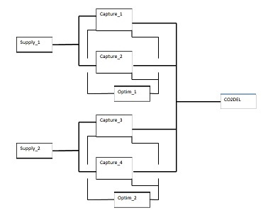

stosim.gallery
==============

data and scripts exampling stosim modeling

 

Latest recovery of old work adds new functions to stosim. This is preliminary to
release on both R-Forge and ultmately CRAN. A co2capture.r script is provided as
a function co2capture(). This will run the original analysis on a moderately
complex co2capture system. The goal of analysis was to determine first the
production weighted availability of CO2 recovery and then the times at various
operating status conditions as a percentage of all time.

Windows users can load the stosim version 0.0.15 from this repository. The
binary is in the stosim_0.0.15.zip file. Do not unzip this in Windows as you
might expect. Rather store this in a local file system and use the “Install
package(s) from local files . . .” option available under the packages menu in
the R Console or similar command available in RStudio.

 

 

~~~~~~~~~~~~~~~~~~~~~~~~~~~~~~~~~~~~~~~~~~~~~~~~~~~~~~~~~~~~~~~~~~~~~~~~~~~~~~~~
source("https://raw.githubusercontent.com/openrelia/stosim.gallery/master/scripts/contour_challenge.r")

~~~~~~~~~~~~~~~~~~~~~~~~~~~~~~~~~~~~~~~~~~~~~~~~~~~~~~~~~~~~~~~~~~~~~~~~~~~~~~~~

 

Output:

 

[1] "Capacity-Hours:   16721690.4996845"

[1] "Total Hours:   17518573.3943354"

[1] "Capacity Weighted Availability:   0.954512112561143"

lvls    PctOfTime       WtdPct

1  0.00 1.304324e-02 0.000000e+00

2  0.15 8.689602e-06 1.303440e-06

3  0.25 8.110774e-04 2.027694e-04

4  0.30 2.963746e-04 8.891237e-05

5  0.40 2.365123e-05 9.460490e-06

6  0.50 2.860133e-02 1.430067e-02

7  0.55 6.777877e-04 3.727833e-04

8  0.60 2.228036e-04 1.336821e-04

9  0.65 6.443405e-04 4.188213e-04

10 0.75 4.862971e-02 3.647228e-02

11 0.80 2.302047e-02 1.841638e-02

12 1.00 8.840894e-01 8.840894e-01

 
